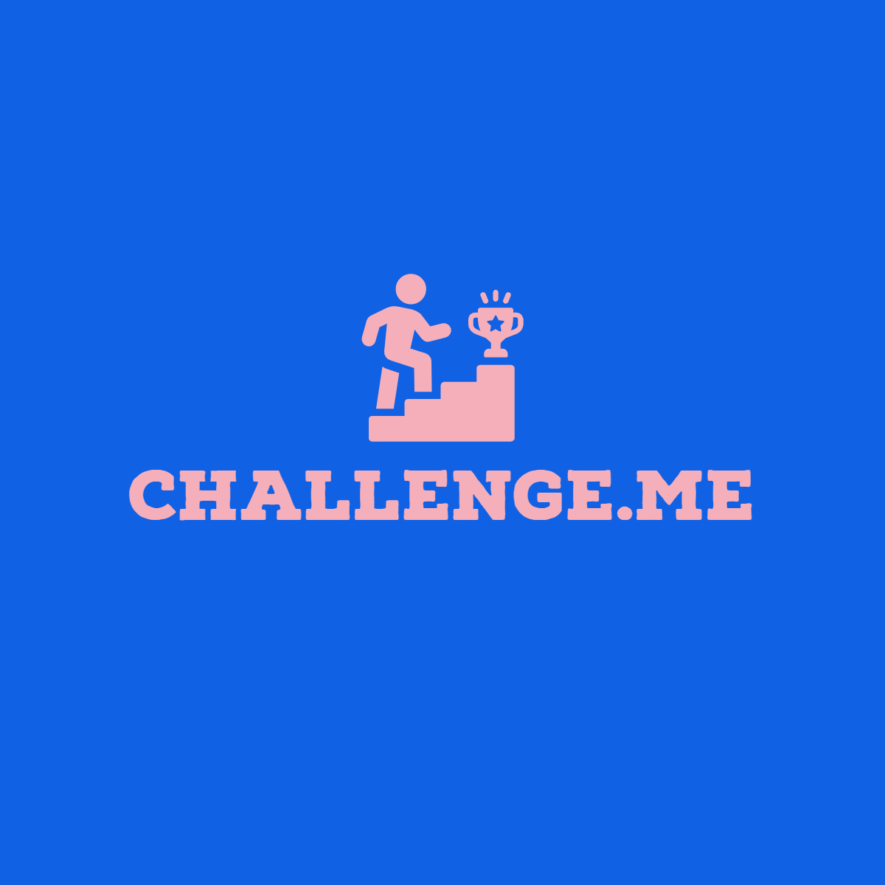
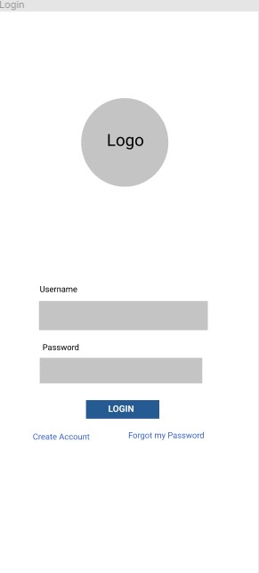
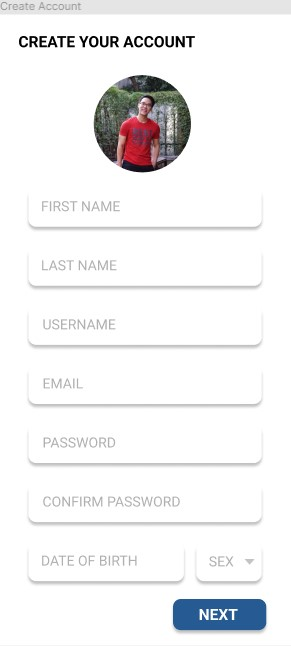
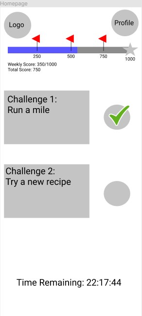
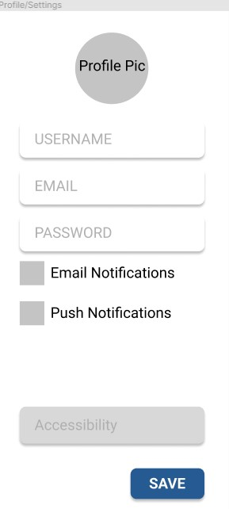
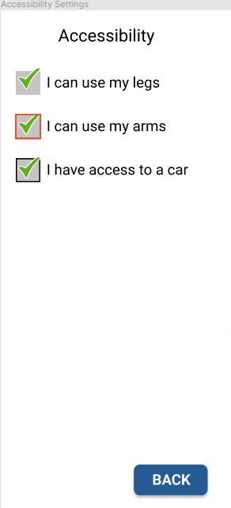

<div id="top"></div>

<!-- PROJECT SHIELDS -->
<!--
*** I'm using markdown "reference style" links for readability.
*** Reference links are enclosed in brackets [ ] instead of parentheses ( ).
*** See the bottom of this document for the declaration of the reference variables
*** for contributors-url, forks-url, etc. This is an optional, concise syntax you may use.
*** https://www.markdownguide.org/basic-syntax/#reference-style-links
-->
[![Contributors][contributors-shield]][contributors-url]
[![Forks][forks-shield]][forks-url]
[![Stargazers][stars-shield]][stars-url]
[![Issues][issues-shield]][issues-url]
[![MIT License][license-shield]][license-url]
[![LinkedIn][linkedin-shield]][linkedin-url]


<!-- PROJECT LOGO -->
<br />
<div align="center">
  <a href="https://github.com/Zach-Clay/Challenge.me">
    
  </a>

<h3 align="center">Challenge.me</h3>

  <p align="center">
    Challenge.me is an app designed to get you out in the world and out of your comfort zone. The app will assign you a variety of tasks to complete in an amount of time and allow you share your experiences with other users! 
    <br />
    <a href="https://github.com/Zach-Clay/Challenge.me"><strong>Explore the docs »</strong></a>
    <br />
    <br />
    <a href="https://github.com/Zach-Clay/Challenge.me">View Demo</a>
    ·
    <a href="https://github.com/Zach-Clay/Challenge.me/issues">Report Bug</a>
    ·
    <a href="https://github.com/Zach-Clay/Challenge.me/issues">Request Feature</a>
  </p>
</div>


<!-- TABLE OF CONTENTS -->
<details>
  <summary>Table of Contents</summary>
  <ol>
    <li>
      <a href="#about-the-project">About The Project</a>
      <ul>
        <li><a href="#built-with">Built With</a></li>
      </ul>
    </li>
    <li>
      <a href="#getting-started">Getting Started</a>
      <ul>
        <li><a href="#prerequisites">Prerequisites</a></li>
        <li><a href="#installation">Installation</a></li>
      </ul>
    </li>
    <li><a href="#usage">Usage</a></li>
    <li><a href="#roadmap">Roadmap</a></li>
    <li><a href="#contributing">Contributing</a></li>
    <li><a href="#license">License</a></li>
    <li><a href="#contact">Contact</a></li>
    <li><a href="#acknowledgments">Acknowledgments</a></li>
  </ol>
</details>


<!-- ABOUT THE PROJECT -->
## About The Project

<!-- [![Product Name Screen Shot][product-screenshot]](https://example.com) -->

Challenge.me is a mobile app that will challenge you to get out in the world and accomplish new things. The app will assign you challenges that you can complete throughout the week and share your progress with friends.

<p align="right">(<a href="#top">back to top</a>)</p>


### Built With

* [React.js](https://reactjs.org/)
* [React Native](https://reactnative.dev/)
* [Express (TypeScript) REST API](http://expressjs.com)
* [PostgreSQL](https://www.postgresql.org/docs/9.1/app-psql.html)
<p align="right">(<a href="#top">back to top</a>)</p>


<!-- GETTING STARTED -->
## Getting Started

This is an example of how you may give instructions on setting up your project locally.
To get a local copy up and running follow these simple example steps.

### Prerequisites

This is an example of how to list things you need to use the software and how to install them.
* npm
  ```sh
  npm install npm@latest -g
  ```

### Installation

1. Get a free API Key at [https://example.com](https://example.com)
2. Clone the repo
   ```sh
   git clone https://github.com/Zach-Clay/Challenge.me.git
   ```
3. Install NPM packages
   ```sh
   npm install
   ```
4. Enter your API in `config.js`
   ```js
   const API_KEY = 'ENTER YOUR API';
   ```

<p align="right">(<a href="#top">back to top</a>)</p>


<!-- USAGE EXAMPLES -->
## Usage

UI/UX Resources and Screenshots from the app

_For more examples, please refer to the [Documentation](https://example.com)_

<p align="right">(<a href="#top">back to top</a>)</p>


<!-- ROADMAP -->
## Roadmap
Here are the wireframe screenshots of our features:
Login Screen

Create Account Screen

Homepage

Profile

Accessibility


See the [open issues](https://github.com/Zach-Clay/Challenge.me/issues) for a full list of proposed features (and known issues).

<p align="right">(<a href="#top">back to top</a>)</p>


<!-- CONTRIBUTING -->
## Contributing

Contributions are what make the open source community such an amazing place to learn, inspire, and create. Any contributions you make are **greatly appreciated**.

If you have a suggestion that would make this better, please fork the repo and create a pull request. You can also simply open an issue with the tag "enhancement".
Don't forget to give the project a star! Thanks again!

1. Fork the Project
2. Create your Feature Branch (`git checkout -b feature/AmazingFeature`)
3. Commit your Changes (`git commit -m 'Add some AmazingFeature'`)
4. Push to the Branch (`git push origin feature/AmazingFeature`)
5. Open a Pull Request

<p align="right">(<a href="#top">back to top</a>)</p>


<!-- LICENSE -->
## License

Distributed under the MIT License. See `LICENSE.txt` for more information.

<p align="right">(<a href="#top">back to top</a>)</p>


<!-- CONTACT -->
## Contact

Zachary Clay - [@LinkedIn](https://www.linkedin.com/in/zachary-clay-027215203/) - Email: zachclayc130@gmail.com

Amara Obasi - [@LinkedIn](https://www.linkedin.com/in/amaraobasi/) - Email: aobasi4@gmail.com (Scrum Master)

Kita Pairojtanachai (Chris) - [@LinkedIn](https://www.linkedin.com/in/chris-kpc/) - Email: kita.pairojtanachai@gmail.com

David Brown - [@LinkedIn](https://www.linkedin.com/in/david-brown-44b2a9193/) - Email: dbrown3562@gmail.com

Project Link: [https://github.com/Zach-Clay/Challenge.me](https://github.com/Zach-Clay/Challenge.me)

<p align="right">(<a href="#top">back to top</a>)</p>


<!-- ACKNOWLEDGMENTS -->
## Acknowledgments

* []()
* []()
* []()

<p align="right">(<a href="#top">back to top</a>)</p>


<!-- MARKDOWN LINKS & IMAGES -->
<!-- https://www.markdownguide.org/basic-syntax/#reference-style-links -->
[contributors-shield]: https://img.shields.io/github/contributors/Zach-Clay/Challenge.me.svg?style=for-the-badge
[contributors-url]: https://github.com/Zach-Clay/Challenge.me/graphs/contributors
[forks-shield]: https://img.shields.io/github/forks/Zach-Clay/Challenge.me.svg?style=for-the-badge
[forks-url]: https://github.com/Zach-Clay/Challenge.me/network/members
[stars-shield]: https://img.shields.io/github/stars/Zach-Clay/Challenge.me.svg?style=for-the-badge
[stars-url]: https://github.com/Zach-Clay/Challenge.me/stargazers
[issues-shield]: https://img.shields.io/github/issues/Zach-Clay/Challenge.me.svg?style=for-the-badge
[issues-url]: https://github.com/Zach-Clay/Challenge.me/issues
[license-shield]: https://img.shields.io/github/license/Zach-Clay/Challenge.me.svg?style=for-the-badge
[license-url]: https://github.com/Zach-Clay/Challenge.me/blob/master/LICENSE.txt
[linkedin-shield]: https://img.shields.io/badge/-LinkedIn-black.svg?style=for-the-badge&logo=linkedin&colorB=555
[linkedin-url]: https://linkedin.com/in/linkedin_username
[product-screenshot]: images/screenshot.png
